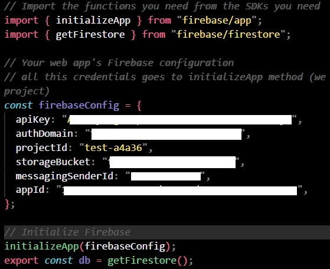

# Authentication and Storage with Firebase

This is a project boilerplate for implementing sign up/in functionalities with Firebase and working with Firestore. Features included:

- Creating a Firebase Project
- Creating project database in Firestore
- Sign up and Log in with email and password
- Sign up and Log in with Google pop-up
- Logging out
- Reseting a password - sending an email with a reset
- Adding a documents to Firestore database
- Fetching multiple documents from Firestore database
- Managing forms in React
- React Router
- useNavigate, useEffect and useState hooks

## Steps:

#### Creating a project and setting authentication providers:

1. Log in into your Google Account and go to [firebase.google.com](https://firebase.google.com/).
2. Click 'Go to console'
3. Click 'Add project'
4. Enable/Disable google analytics for your projects as you need
5. Create a firebase.config.js file in your project
6. Install firebase in your project - _npm i firebase_
7. Create ‘web’ app within firebase to get config values
8. Copy the code from project initialization and paste it into firebase.config.js
9. As an SDK we are importing firestore: _import {getFirestore} from ‘firebase/firestore’_
10. Export your db from config file: _export const db = getFirestore()_

    1. Code example snippet:

       

11. In your browser, in firebase, click _continue to console_
12. Go to the authentication section of your project, click _get started_
13. You can pick different providers, for this project we choose email/password and google providers. Enable email/password then add another provider → google → Set a public name of your project and add your email address → save
14. In the authentication tab you should see the dashboard of all users that signed in to your app1
15. _Add one_ user manually from the dashboard (as an example)

#### Creating Firestore database for our project:

1. Go to _Firestore Database_ and create a new DB
2. Choosing between production/test mode gives you different database rules (we can say settings) .For this repo we choose test mode
3. Choose a location
4. You should see your database dashboard
5. Now we need to configure rules for our database. Rules are written in Common Expression Language (CEL). Cloud Firestore Security Rules allow you to control access to documents and collections in your database. You can write simple or complex rules that protect your app's data to the level of granularity that your specific app requires.
6. Into the rules paste the following code :

```
rules_version = '2';
service cloud.firestore {
  match /databases/{database}/documents {
    // Products
    match /products/{products} {
    	allow read;
      allow create: if request.auth != null;
    	allow delete: if resource.data.userRef == request.auth.uid;
    }

    // Users
    match /users/{user} {
    	allow read;
    	allow create;
    	allow update: if request.auth.uid == user
    }
  }
}

```

7. Now let's add a example document in your products collection:
   1.Start collection in Firestore, then create

   1. name-string
   2. price-number
   3. description-string
   4. bestSeller-boolean
   5. timestamp → current timestamp
   6. userRef-string → grab a user id (uid) from authentication tab (to create a user reference)

8. Go to Index tab to create composite indexes.
   A composite index stores a sorted mapping of all the documents in a collection, based on an ordered list of fields to index. Cloud Firestore uses composite indexes to support queries not already supported by single-field indexes.

| ---------- | :---------:|
| bestSeller | Ascending |
| timestamp | Descending |

## Useful links:

- [Get Started](https://firebase.google.com/docs/auth/web/start)
- [Adding user to the Firestore](https://firebase.google.com/docs/firestore/manage-data/add-data)
- [Adding data to the Firestore](https://firebase.google.com/docs/firestore/manage-data/add-data)
- [Fetching data from Firestore](https://firebase.google.com/docs/firestore/query-data/get-data#get_a_document)
